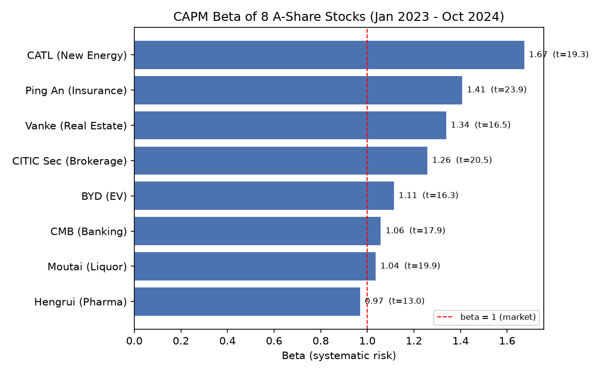
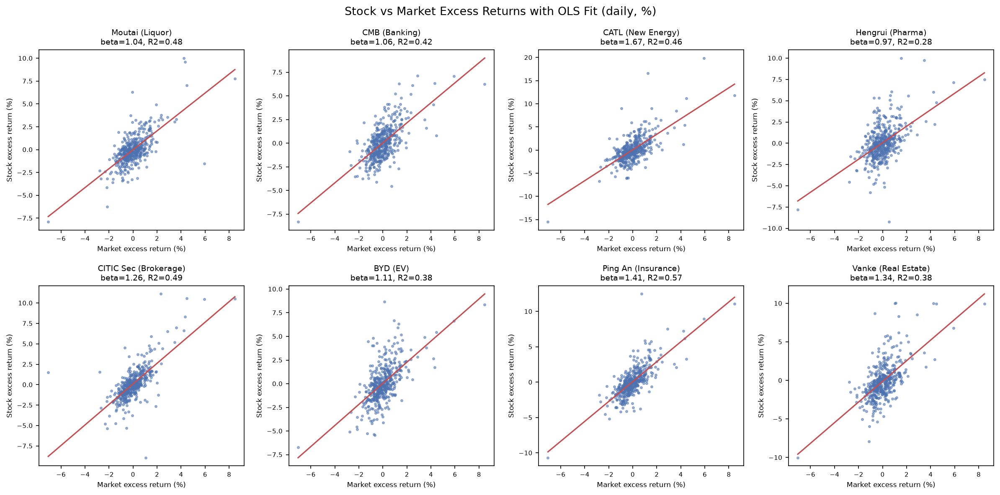
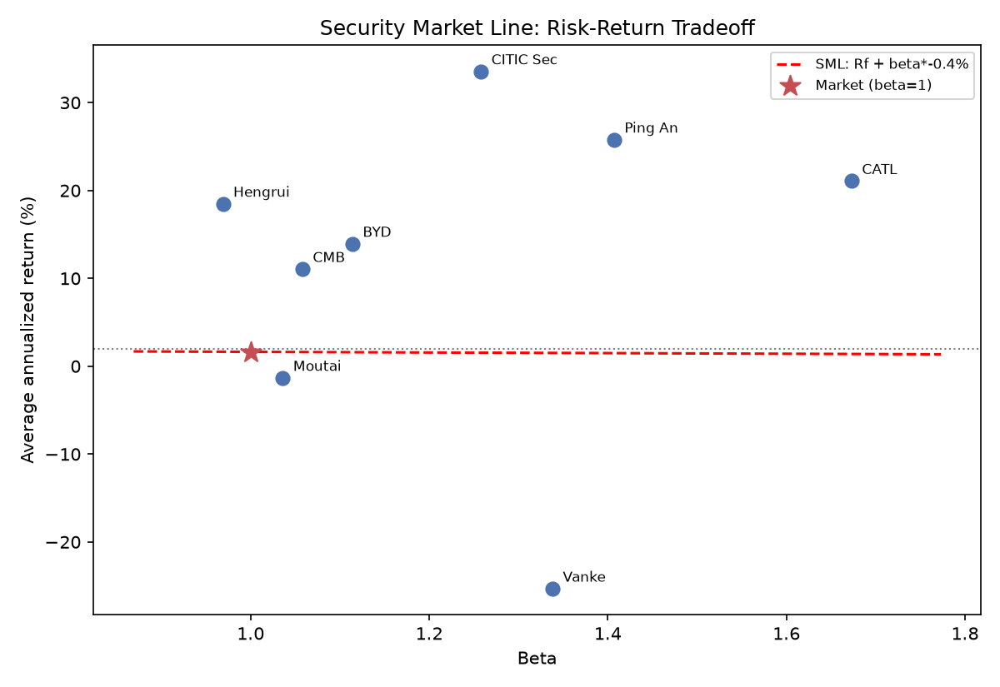

# Python-Based CAPM Analysis of A-Share Stocks

Estimating systematic risk (beta) and excess return (alpha) of 8 sector-leading A-share stocks against the CSI 300 index with OLS regressions, entirely in Python.



---

## Overview

This project applies the Capital Asset Pricing Model (CAPM) to real A-share market data. For each of eight large-cap stocks across different industries, I estimate its beta (sensitivity to market movements) and alpha (return unexplained by the market) by regressing excess stock returns on excess market returns. The estimated betas are then plotted against realized returns to examine the risk-return trade-off implied by the Security Market Line (SML).

**Sample:** Jan 3, 2023 – Oct 31, 2024 · 440 trading days

**Main result:** estimated betas range from 0.97 (Hengrui Pharma) to 1.67 (CATL); growth sectors (new energy, insurance, brokerage, real estate) carry betas above 1 while defensive sectors (banking, liquor, pharma) stay close to 1. The empirical SML comes out nearly flat, showing that higher beta was not rewarded during this bear-market sample — a well-known limitation of CAPM.

## Data

- **Universe (8 stocks):** CATL (new energy) · Ping An (insurance) · Vanke (real estate) · CITIC Securities (brokerage) · BYD (EV / automobile) · China Merchants Bank (banking) · Kweichow Moutai (liquor) · Hengrui Pharma (pharma)
- **Market proxy:** CSI 300 index (000300.SH)
- **Source:** Tencent Finance public API (`web.ifzq.gtimg.cn`) — forward-adjusted (qfq) daily closes for stocks, raw daily index levels
- **Storage:** one CSV per instrument in `data/` (columns: `date, open, close, high, low, volume`)

## Method

For each stock *i*, the market model is estimated by ordinary least squares:

```
R_i − r_f = α_i + β_i · (R_m − r_f) + ε_i
```

- Daily returns: `pct_change()` of adjusted close
- Risk-free rate: constant annual 2%, converted to daily terms (the choice barely affects beta and mainly shifts alpha)
- Regression: `statsmodels` `OLS`; output: beta, alpha, t-stats, R², annualized return and volatility

## Key Findings

| Stock | Sector | Beta | t | R² | Ann. return |
|---|---|---|---|---|---|
| CATL | New energy | 1.67 | 19.3 | 0.46 | +21.1% |
| Ping An | Insurance | 1.41 | 23.9 | 0.57 | +25.8% |
| Vanke | Real estate | 1.34 | 16.5 | 0.38 | −25.3% |
| CITIC Securities | Brokerage | 1.26 | 20.5 | 0.49 | +33.6% |
| BYD | EV / automobile | 1.11 | 16.3 | 0.38 | +14.0% |
| China Merchants Bank | Banking | 1.06 | 17.9 | 0.42 | +11.1% |
| Kweichow Moutai | Liquor | 1.04 | 19.9 | 0.48 | −1.3% |
| Hengrui Pharma | Pharma | 0.97 | 13.0 | 0.28 | +18.5% |

1. **Clear sector pattern.** Growth sectors load above 1 on the market; defensive sectors sit near or below 1.
2. **All betas are statistically significant** (t > 13) — the sector pattern is not noise.
3. **The market explains only part of the variation** (R² = 0.28–0.57); the rest is idiosyncratic, which is why estimated alphas are insignificant.
4. **The SML is nearly flat in this sample.** The annualized market risk premium was about −0.4%, so high beta went unrewarded: CITIC Securities (β = 1.26) gained ~34% a year while Vanke (β = 1.34) lost ~25%, both moves driven by industry and company events rather than beta. This reproduces the well-documented "flat SML" pattern in bear markets.





Full regression summary: [`results/capm_results.csv`](results/capm_results.csv)

## Repository Layout

```
├── README.md
├── requirements.txt
├── capm_fetch.py        # fetch script (run once; saves data/*.csv)
├── capm_analysis.py     # main analysis script (offline, reads data/*.csv)
├── data/                # 9 CSV files of daily quotes
└── results/
    ├── capm_results.csv # regression summary for the 8 stocks
    ├── fig1_beta.png    # beta bar chart
    ├── fig2_scatter.png # stock vs market scatter + fit (2x4)
    └── fig3_sml.png     # security market line
```

## Reproduction

```bash
# 1. environment (once)
python3 -m venv .venv
source .venv/bin/activate          # Windows: .venv\Scripts\activate

# 2. dependencies (once)
pip install -r requirements.txt

# 3. fetch data (optional — data/ is already committed; requires network)
python capm_fetch.py

# 4. run the analysis (no network needed)
python capm_analysis.py
# outputs: results/capm_results.csv + 3 PNG figures
```

## Tech Stack

Python 3 · pandas / numpy · statsmodels (OLS) · matplotlib · Tencent Finance public API

## Limitations

1. Short, bear-market sample (~2 years); the cross-sectional risk-return relationship is not significant over this window
2. Risk-free rate approximated by a constant 2% rather than matched daily treasury yields
3. Time-series regressions only — no Fama-MacBeth cross-sectional tests
4. No trading-cost / liquidity adjustments
